# Dynamic NFT Minting Demo

A simple Next.js application demonstrating gasless NFT minting using Dynamic and ZeroDev.

🚀 **Live Demo**: [https://darkbastion.com](https://darkbastion.com) - Try the gasless NFT minting experience!

## Getting Started

### Step 0: Create Accounts

1. Create a Dynamic account at [https://app.dynamic.xyz/](https://app.dynamic.xyz/)
2. Create a ZeroDev account at [https://dashboard-v1.zerodev.app/](https://dashboard-v1.zerodev.app/)
3. **Note**: To use Polygon mainnet, you'll need to establish a billing account (you'll be on the free tier)

### Step 1: Configure Authentication

1. Go to [Dynamic Login User Profile](https://app.dynamic.xyz/dashboard/log-in-user-profile)
2. Enable email authentication for your Dynamic app

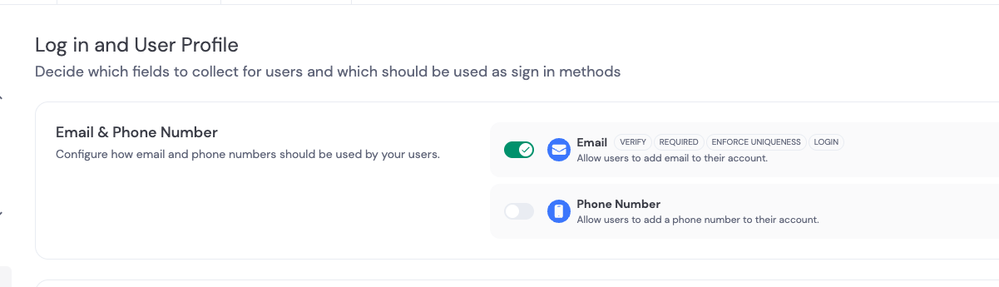

### Step 2: Setup Chains and Networks

1. Navigate to [Dynamic Chains and Networks](https://app.dynamic.xyz/dashboard/chains-and-networks)
2. Disable Ethereum mainnet
3. Select Polygon mainnet
4. **Note**: You'll need to set up a billing account with Dynamic to use mainnet

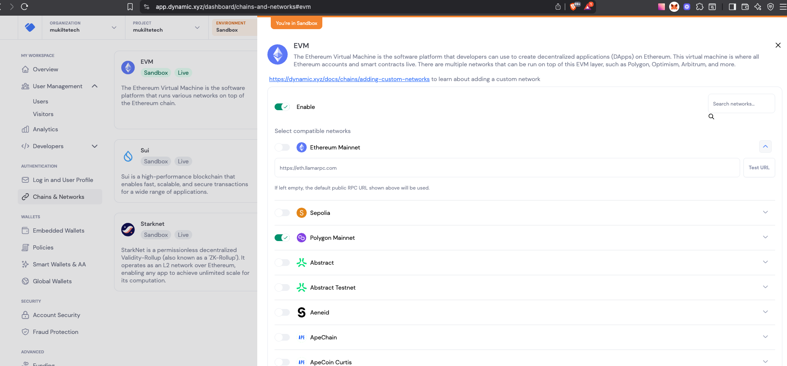

### Step 3: Setup ZeroDev Project and Paymaster

1. **Create ZeroDev Project**:
   - Go to [ZeroDev Dashboard](https://dashboard-v1.zerodev.app/)
   - Set up a new project

2. **Create Paymaster Contract**:
   - Navigate to [ZeroDev Self-Funded Paymasters](https://dashboard-v1.zerodev.app/self-funded-paymasters)
   - Create a new paymaster contract on the Polygon network
   - **Note**: You'll need to add billing to enable mainnets
   - Connect a wallet using MetaMask (ensure it's funded with POL)
   - Click "Deploy" for your Verifying Paymaster
   - Fund the deployed paymaster with POL to sponsor user gas fees

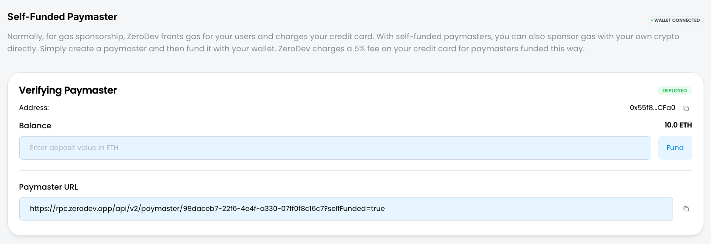

3. **Setup Gas Policy**:
   - Go to [ZeroDev Paymasters](https://dashboard-v1.zerodev.app/paymasters)
   - For demo purposes, set up your paymaster to sponsor up to 10 POL per minute

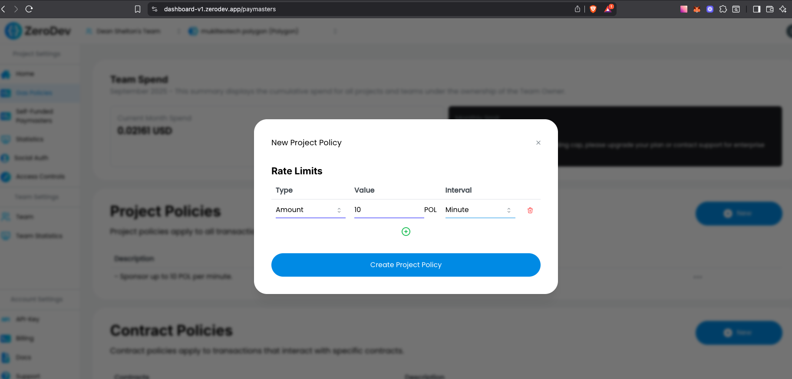

### Step 4: Configure Smart Wallets

1. Go to [Dynamic Smart Wallets](https://app.dynamic.xyz/dashboard/smart-wallets)
2. Set up smart wallets to link your ZeroDev account:
   - Check "Create AA for branded wallets" for "All users"
   - Select the ZeroDev option

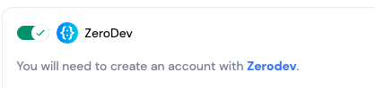

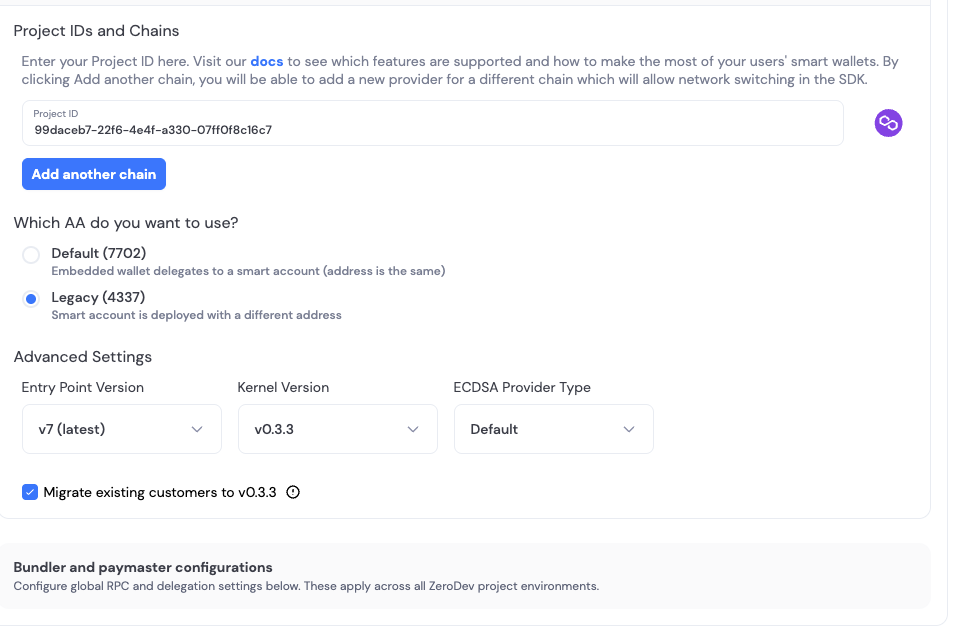

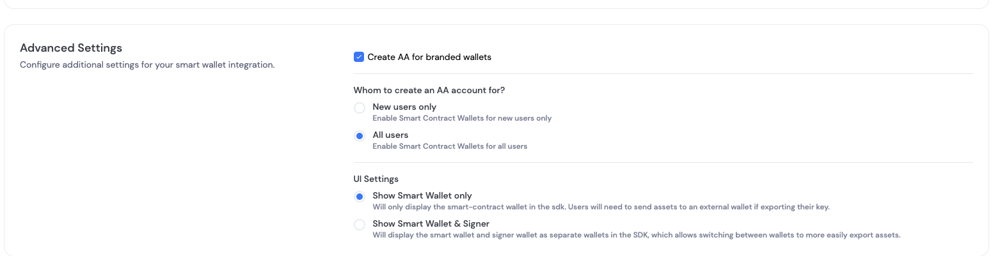

4. **Link ZeroDev to Dynamic**:
   - Copy your ZeroDev project ID from [ZeroDev Dashboard](https://dashboard-v1.zerodev.app/)

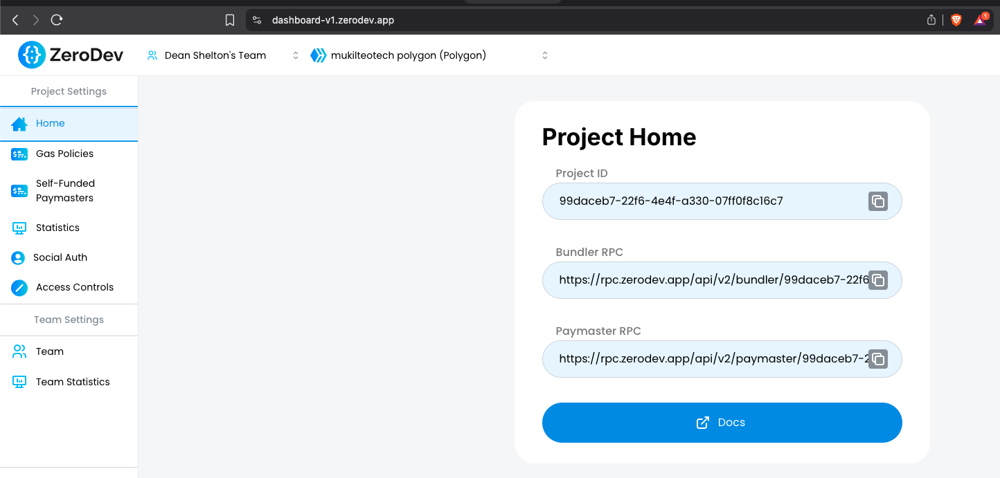

   - Paste it into the ZeroDev configuration page at [Dynamic Smart Wallets](https://app.dynamic.xyz/dashboard/smart-wallets)

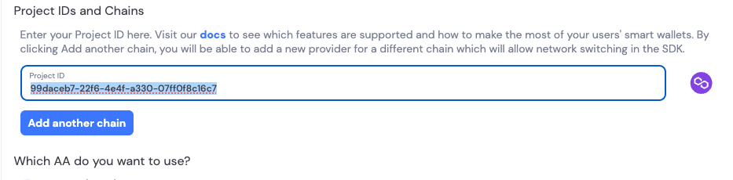

### Step 5: Enable Security Features

1. Go to [Dynamic Security Settings](https://app.dynamic.xyz/dashboard/security)
2. Enable passkeys and authenticator apps

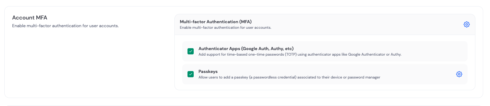

### Step 6: Environment Setup

Copy the environment template and configure your settings:

```bash
cp env.template .env.local
```

Edit `.env.local` and update the following values:

- **`NEXT_PUBLIC_DYNAMIC_ENVIRONMENT_ID`**: Your Dynamic environment ID from the Dynamic dashboard
- **`NEXT_PUBLIC_CONTRACT_ADDRESS`**: The NFT contract address (default provided, or use your own deployed contract)

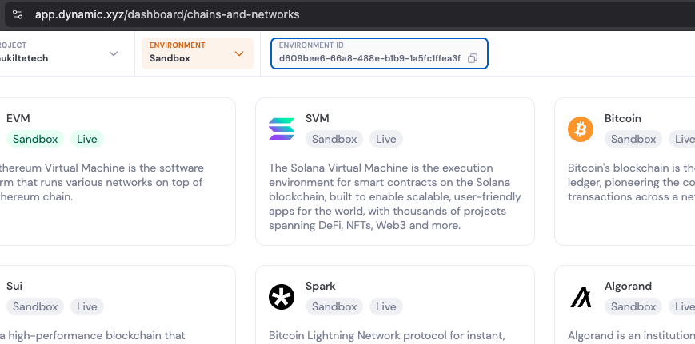

### Step 7: Install Dependencies and Run the Development Server

Install the required dependencies:

```bash
npm install
```

Run the development server:

```bash
npm run dev
```

Open [http://localhost:3000](http://localhost:3000) in your browser.

## Optional: Deploy Your Own Contract

If you want to deploy your own NFT contract to Polygon instead of using the default one:

### Prerequisites

1. **Alchemy Account**: Get a Polygon RPC URL from [Alchemy](https://www.alchemy.com/)
2. **Polygonscan API Key**: Get an API key from [Polygonscan](https://polygonscan.com/apis)
3. **Private Key**: A wallet private key with MATIC for gas fees

### Environment Variables

Add these variables to your `.env.local` file:

```bash
# Contract deployment variables
DEPLOY_POLYGON_RPC_URL=https://polygon-mainnet.g.alchemy.com/v2/your_alchemy_key_here
DEPLOY_POLYGONSCAN_API_KEY=your_polygonscan_api_key_here
DEPLOY_CONTRACT_PRIVATE_KEY=your_private_key_here
```

### Deploy the Contract

Run the deployment script:

```bash
npm run contracts:deploy:polygon
```

This will:
- Compile the DynamicNFT contract
- Deploy it to Polygon mainnet
- Verify the contract on Polygonscan
- Output the contract address

After deployment, update `NEXT_PUBLIC_CONTRACT_ADDRESS` in your `.env.local` with the new contract address.

## Features

- Gasless NFT minting using ZeroDev smart wallets
- Dynamic wallet connection and authentication
- Custom NFT contract with public minting functionality
- Polygon network support
- Contract verification on Polygonscan

## Contract Details

The included `DynamicNFT.sol` contract provides:
- Public minting function (`mintTo`)
- Owner-only minting function (`safeMint`)
- Token URI storage
- Total supply tracking
- Standard ERC721 functionality
